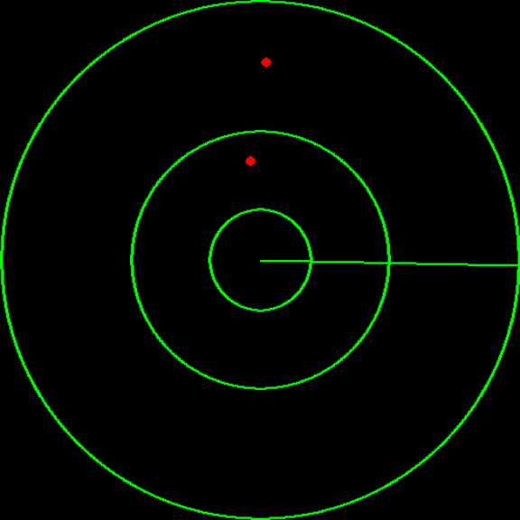

# PyGame radar 2D 


> Radar application, showing polar points. This application starts a new thread for the UI part allowing to use it inside an other script. 

## Dependencies
PyGame = 1.9.6 

## Use it


```
# importation 
from pygame_radar_2D.radar import Radar
from pygame_radar_2D.point import PointPolar

# radar declaration
radar = Radar(300,r_lim=300,fps=30,point_size=5)
radar.start()

(...)

# set points 
radar.set_points([p0,p1,...,pN])
```

Look the example **example-001-basic.py**


## Examples

Simple example showing the plot of 2 random data 

